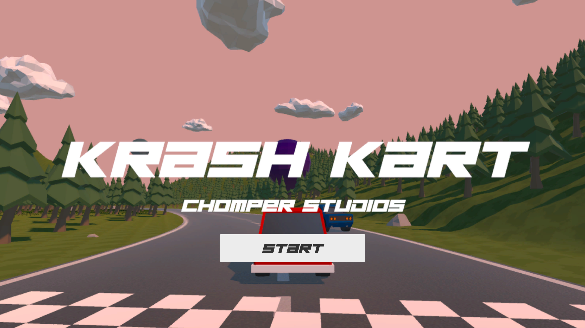
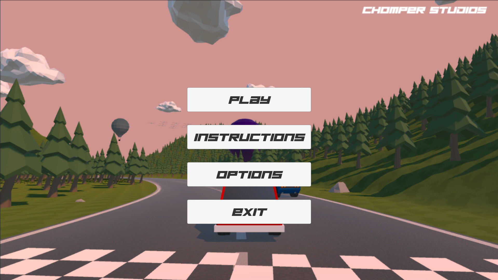
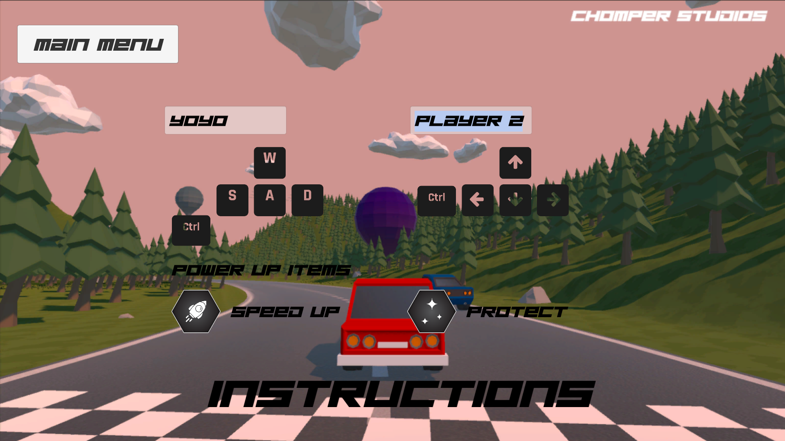
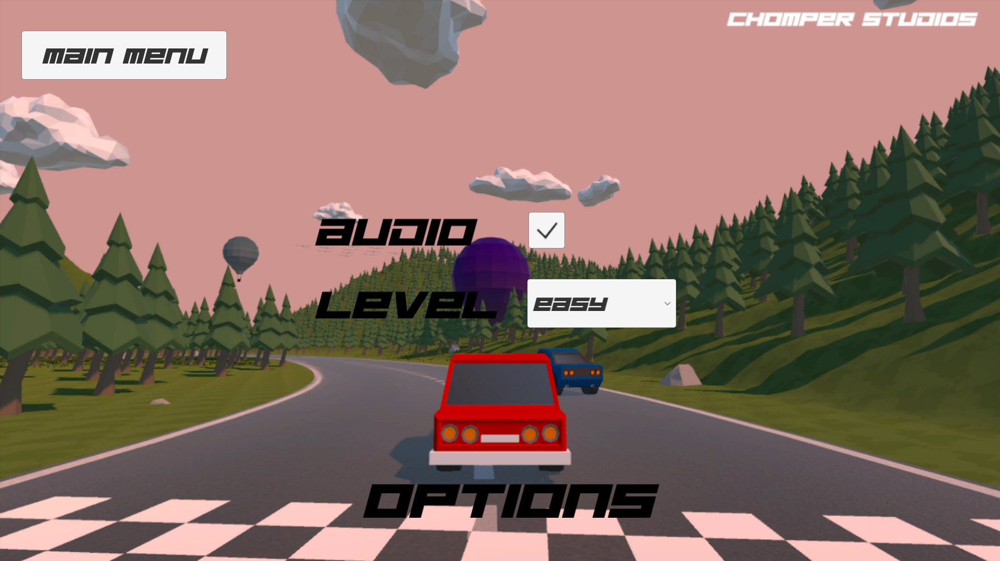
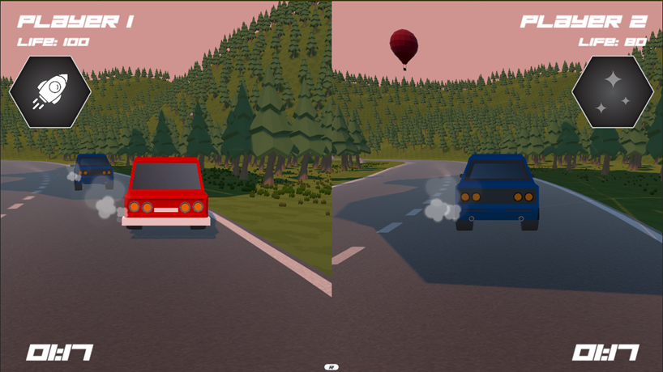
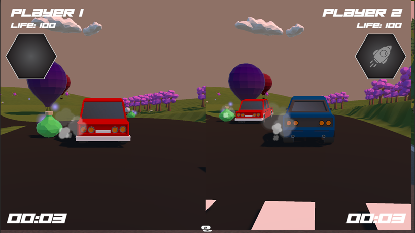
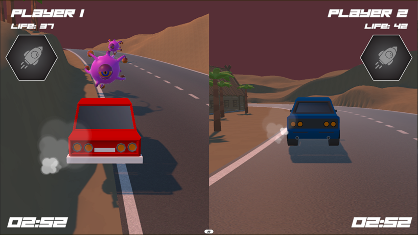
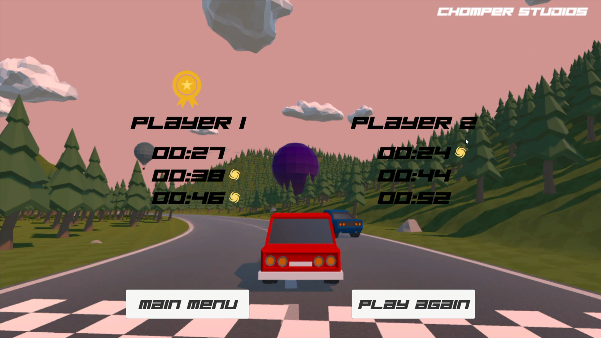

# KrashKart

## Gameplay
- **Player 1 Controls**: Controls the left-hand side car using `WASD` for movement and `Left Shift` for power-up.
- **Player 2 Controls**: Controls the right-hand side car using `Arrow Keys` for movement and `Right Shift` for power-up.
- **Winning Condition**: The fastest player to reach the finish line wins the round.
- **Leaderboard**: Displays the player who has won the most rounds.

## Game Scene
### Game Start
- **Start**: Enter the Main Menu scene

## Main Menu Scene
- **Play**: Enter the game level
- **Instructions**: Show the instructions of the game
- **Options**: Show the audio and level options
- **Exit**: Exit the game

## Instructions Scene
- **Player Name**: Input field for players to input their names
- **Controls**: Show the control of each player
- **Powerup Items**: Show the available pickup items in the game and their functions
- **Main Menu**: Go back to the main menu

## Options Scene
- **Audio**: Opt in/out the audio during the game
- **Level**: Choose the game level (only available after players finish the previous one)
- **Main Menu**: Go back to the main menu

## Game Scene Scene
- **Name**: Display players’ name
- **Life**: Players’ remaining life (Increases when taking reward items; decreases when getting attacked)
- **Power-up Showbox**: Displays a grey icon when a power-up is picked up, highlights it during use, and removes it after use
- **Timer**: Real-time tracking of players’ race time
 ### Easy Level

 ### Medium Level

 ### Hard Level

## Game Over (Leaderboards) Scene
- **Display**: Show race time of each player in different levels
- **Main Menu**: Go back to the main menu
- **Play Again**: Enter the first level (easy level) of the game

## Build & Source Code
- Demonstration Video: https://youtu.be/eu1CTlrcLD0
- WebGL Version Available (PC): https://yobisaboy.itch.io/harmony-heroes
- Game Download: https://github.com/yobisaboy/HarmonyHeros
- Unity Project: https://github.com/CR3XX12/COMP390_001_HarmonyHero

## Contact
- Tel: +1 (647) 637-0831
- Email: hoyiuyiuyoyo@gmail.com
- LinkedIn: https://www.linkedin.com/in/yoyoho
- Portfolio: https://yobisaboy.github.io/Portfolio